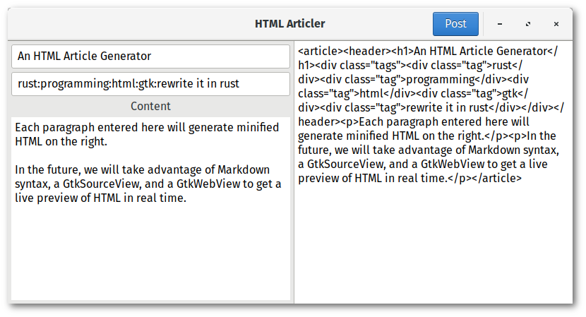

# Programming the UI

So, with all the widgets that are going to interact with each other, you might think that this
part will be a tiny bit difficult to implement. Well, if you think that, you're completely
wrong, as this will actually be the easiest part of the program to implement! Starting with
chapter 1's main function as a template, which looks like so:

```rust
fn main() {
    // Initialize GTK before proceeding.
    if gtk::init().is_err() {
        eprintln!("failed to initialize GTK Application");
        process::exit(1);
    }

    // Initialize the UI's initial state
    let app = App::new();

    // Program your widgets here!

    // Make all the widgets within the UI visible.
    app.window.show_all();

    // Start the GTK main event loop
    gtk::main();
}
```

We are going to program the **Post button** to take the **title** and **tags** entries, as well
as the **content** text view's buffer, pass the strings from these widgets directly through
a horrorshow HTML macro, and write the output into the **right_pane's** text buffer. The code for
programming the button will look as follows:

```rust
{
    // Program the post button to take the inputs in the left pane, and update HTML code
    // within the right pane accordingly. Prepared to increment reference counters...
    let title = app.content.title.clone();
    let tags = app.content.tags.clone();
    let content = app.content.content.clone();
    let right_pane = app.content.right_pane.clone();
    app.header.post.connect_clicked(move |_| {
        let inputs = (title.get_text(), tags.get_text(), get_buffer(&content));
        if let (Some(title), Some(tags), Some(content)) = inputs {
            right_pane.set_text(&generate_html(&title, &tags, &content));
        }
    });
}
```

Note that obtaining the text from an entry is very straightforward. All it takes is to invoke the
**get_text()** method, which returns an **Option\<String\>**. Getting text from a text buffer is
slightly more difficult, so you will need to use the abstraction that was recommended at the
beginning of this chapter. This function is written as so:

```rust
/// Obtain the entire text buffer's contents as a string.
fn get_buffer(buffer: &TextBuffer) -> Option<String> {
    let start = buffer.get_start_iter();
    let end = buffer.get_end_iter();
    buffer.get_text(&start, &end, true)
}
```

You will also notice this interesting pattern in Rust that has majorly simplified things for us
when obtaining each of the inputs, to collectively check if all inputs have an input before
attempting to do anything with the inputs. The **if let** syntax in Rust works on more than just
patterns, but tuples as well, so you may check multiple values within a tuple at the same time,
just as you would in a **match**.

```rust
let inputs = (title.get_text(), tags.get_text(), get_buffer(&content));
if let (Some(title), Some(tags), Some(content)) = inputs {
    right_pane.set_text(&generate_html(&title, &tags, &content));
}
```

Althugh we have yet to define our **generate_html** function, and this will be the final
component for implementing this application. The simplest way to use the **html!** macro is to
use it as an argument within the **format!** macro. And so, our function will look as so,
although you are free to implement the HTML macro however you like.

```rust
/// Generates the minified HTML that will be displayed in the right pane
fn generate_html(title: &str, tags: &str, content: &str) -> String {
    format!{
        "{}",
        html!{
            article {
                header {
                    h1 { : &title }
                    div(class="tags") {
                        @ for tag in tags.split(':') {
                            div(class="tag") { : tag }
                        }
                    }
                }
                @ for line in content.lines().filter(|x| !x.is_empty()) {
                    p { : line }
                }
            }
        }
    }
}
```

The above syntax should be fairly readable. We create a pair of **article** tags, which contain
a both a pair of **header** tags, and and a **p** paragraph for each non-empty line of input that
was obtained from the **content** text buffer. Within the **header** tags is a **h1** header that
is defined to use the title entry as the text within, and a **div** that contains a list of tags,
delimited by colons.



With all this in place, you should have a fully functioning program that looks like the original
picture.