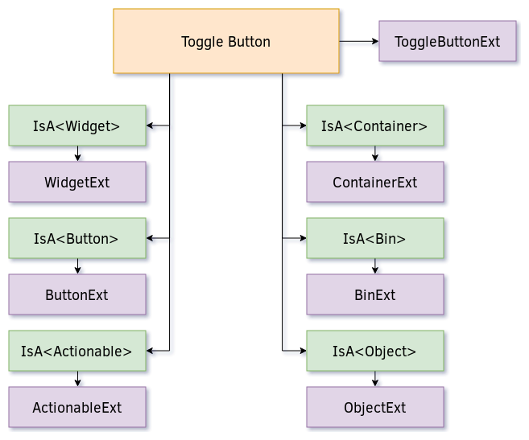
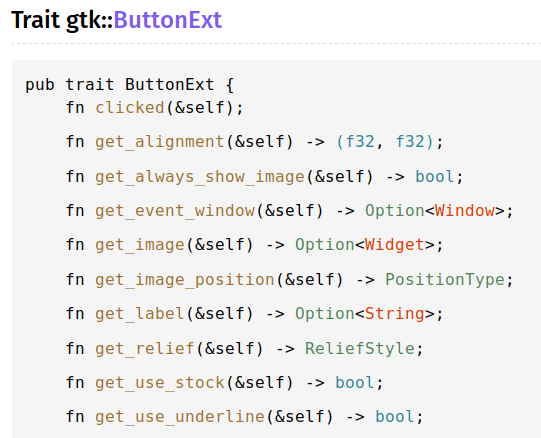
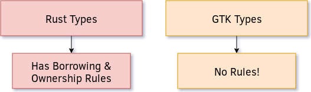

# Introduction & Tips

This unofficial GTK Rust tutorial series will focus on documenting important GTK features,
demonstrating how they are used in practice, and displaying some Rusty software techniques
along the way, as we explore what GTK GUI development in Rust is like.

> This tutorial is a very early WIP, and is subject to make structural changes in the coming
> weeks, until I am happy with the state of the documentation, and my own writing. If there
> are any issues, please send them to my [email](mailto:mmstickman@gmail.com), and I will
> quickly address them. The GTK API is rather extensive, so it may take a while to flesh this
> out properly.

## Obtaining the GTK documentation

The first thing you should do is to specify the GTK features you need. The max supported
version at this time is **v3_22**, which looks like so in your **Cargo.toml** file.

```toml
gtk = { version = "0.2", features = ["v3_22"] }
```

Then you can obtain offline documentation via running the following in the terminal, within
the root directory of your Cargo project:

```sh
cargo doc
```

Which will compile the documentation into **target/doc/gtk/index.html**.

## Tips Regarding Navigating the GTK Rust API



The API for GTK in Rust is not as you might expect from other Rusty APIs, and so it may seem
that there is a lot of missing functionality in the generated documentaion. Each GTK object
contains an associated **ObjectExt** trait, such as **ButtonExt**.



They also gain access to a number of other shared traits through the **IsA\<T\>** wrappers,
such as **IsA\<Container\>**, and **IsA\<Widget\>**. So if you want to know all of the methods
that are available for an object, you will need to also visit the associated traits for each of
those **IsA\<T\>** types that are implemented, such as **WidgetExt**.


## GTK Objects Don't Require Mutability



GTK objects have their own mechanisms of reference counting, and are designed so that
you don't require ownersip or mutable access to modify them. This simplifies things greatly,
as you will only have to worry about borrowing and ownership with native Rust types. The only
thing that you need to be aware of is that you will need to increment reference counters when
passing GTK objects into closures to program your UI, which is done by cloning the object.